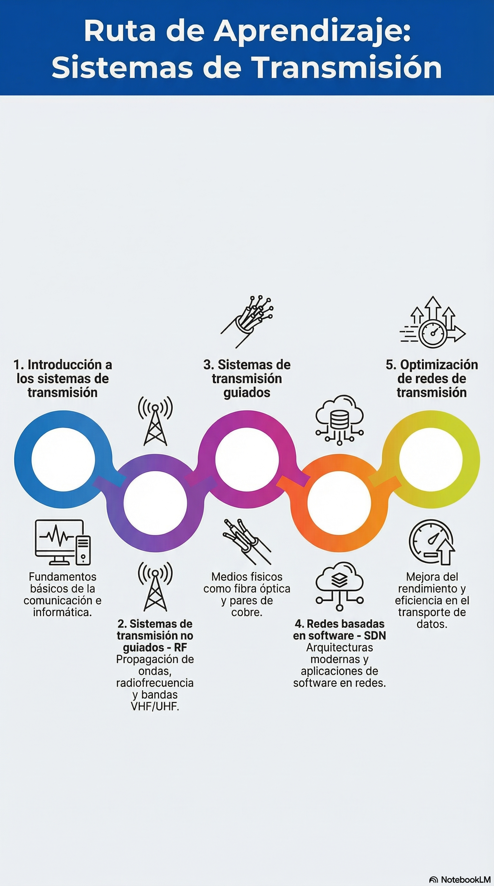

<p align="center">
  
</p>

<h1 align="center">📡 Sistemas de Transmisión - III CRIM</h1>

<p align="center">
  <strong>Academia Politécnica Militar (ACAPOMIL) - Ejército de Chile</strong> 🇨🇱
</p>

<p align="center">
  <a href="https://github.com/Milesfox04/Sistemas-de-transmision">
    
  </a>
  
  
  
  
</p>

<p align="center">
  
</p>

<p align="center">
  <a href="https://github.com/Milesfox04/Sistemas-de-transmision"><strong>🔗 Ver repositorio en GitHub</strong></a>
</p>

> **Objetivo principal:** Analizar un sistema de transmisión desde los fundamentos teóricos y prácticos que sustentan las tecnologías de aplicación militar.[^2]

---

## Índice

- [Acerca del curso](#acerca-del-curso)
- [Contenidos detallados del curso](#contenidos-detallados-del-curso)
- [Criterios e indicadores de evaluación](#criterios-e-indicadores-de-evaluación)
- [Bibliografía oficial](#bibliografía-oficial)
- [Guía de GitHub: ¿cómo descargar este material?](#guía-de-github-cómo-descargar-este-material)
- [Notas y referencias](#notas-y-referencias)
- [Licencia](#licencia)

---

<a id="acerca-del-curso"></a>

## Acerca del curso

Esta unidad de aprendizaje corresponde a la **Unidad N.° 2 del Módulo de Procesos** y está diseñada para que los alumnos apliquen conocimientos avanzados sobre los distintos medios físicos y guiados en redes de transmisión.[^2] El curso abarca desde la propagación de ondas de radio y el cálculo de enlaces hasta el despliegue de redes de fibra óptica y redes definidas por software (SDN).

---

<a id="contenidos-detallados-del-curso"></a>

## 🗂️ Contenidos Detallados del Curso

El programa de **76 horas** se divide exhaustivamente en las siguientes áreas de estudio [1, 2]:

### 1. Introducción a los sistemas de transmisión (8 Horas)

- Descripción general de los distintos medios físicos de transmisión [1].
- Introducción a las comunicaciones RF y comunicaciones en fibra óptica [1].
- Comunicaciones en pares de cobre [1].
- Redes inalámbricas de transmisión de datos para LAN/MAN/WAN [1].
- Redes basadas en software, aplicaciones y usos [1].

### 2. Sistemas de transmisión no guiados - RF (24 Horas)

- **Fundamentos de propagación:** Introducción a la propagación de ondas de radio, bandas de frecuencias y propagación en la atmósfera [1].
- **Antenas y Redes:** Antenas y reflectores, principios de funcionamiento de redes VHF/UHF/HF, broadcasting y tecnologías VHF/UHF [1].
- **Cálculos:** Propagación, cálculo de enlaces y pérdidas para VHF/UHF (FSPL) [1, 3].
- **Microondas:** Principios de funcionamiento, cálculo de enlace, ganancias y atenuaciones, Zona de Fresnel y aplicaciones de redes [1].
- **Comunicaciones satelitales:** Órbitas y propagación, cálculos de enlaces satelitales, enlaces de subida/bajada y pérdidas [1].
- **Sistemas de Radar:** Tipos de radares, arquitecturas y medidas básicas, propagación de ondas de radares, ecuaciones de recepción, efectos multipath y ruido [1].

### 3. Sistemas de transmisión guiados (16 Horas)

- **Cables Metálicos:** Características de los cables, cable par de cobre y medidas de impedancia [1].
- **Fibra Óptica:** Introducción y arquitecturas de redes de fibra óptica [1].
- **Ruteo y Protección:** Procesos y algoritmos de ruteo en redes de fibra óptica, ruteo WDM, ruteo dinámico, redes multicapa y redes overlay [1].
- **Mantenimiento de Señal:** Regeneración de señales y técnicas/métodos de protección en redes de fibra [1].

### 4. Redes basadas en software - SDN (16 Horas)

- Arquitecturas de redes de conmutación de paquetes IP y virtualización de las funciones de los nodos [1].
- Desarrollo, componentes, funciones y aplicaciones de las Software Defined Networks (SDN) [1].
- Suite de protocolos OpenFlow y OpenStack [1].
- Aplicaciones militares de las SDN [1].
- **SDMN:** Redes móviles y SDN (Software Defined Mobile Networks), arquitecturas SDMN, redes LTE e integración de SDMN [1].

### 5. Optimización de redes de transmisión (12 Horas)

- Introducción a las topologías de redes y grafos (representación de redes, nodos/vértices y enlaces/arcos) [1].
- Conectividad, confiabilidad y enlaces de respaldo [1].
- Grafos aleatorios y evaluación del problema del camino más corto (incluyendo ponderación de enlaces y evitar loops) [1].
- Transmisión multicast, anycast y su aplicación al problema del camino más corto [1].

---

<a id="criterios-e-indicadores-de-evaluación"></a>

## 🎯 Criterios e Indicadores de Evaluación (Competencias)

El curso se estructura en **5 grandes criterios de evaluación**, orientados a asegurar el desempeño técnico y táctico del alumno.[^1]

### 1. Comprende sistemas de transmisión

- **1.1:** Explica comunicaciones en RF y fibra óptica.[^1]
- **1.2:** Identifica redes inalámbricas de transmisión de datos (LAN/MAN/WAN).[^1][^3]

### 2. Analiza los medios de transmisión no guiados

- **2.1:** Examina los procesos de propagación de ondas en la atmósfera.[^1][^3]
- **2.2:** Interpreta las bandas de frecuencia (VHF/UHF/HF).[^1][^3]
- **2.3:** Analiza el funcionamiento de redes VHF, UHF y HF (Broadcasting y Punto a Punto).[^1][^3]
- **2.4:** Calcula enlaces y pérdidas teóricas para VHF/UHF.[^1][^3]
- **2.5:** Calcula el enlace satelital (órbitas y propagación).[^1][^3]
- **2.6:** Analiza sistemas de radar, su clasificación y ecuaciones de recepción.[^1][^3]

### 3. Analiza los medios de transmisión guiados

- **3.1 / 3.2:** Aplica conceptos y examina la estructura de la fibra óptica.[^1]
- **3.3:** Interpreta los tipos de modos de propagación (Monomodo / Multimodo).[^1][^3]
- **3.4:** Analiza las características, parámetros y límites (atenuación y dispersión).[^1]
- **3.5 / 3.6:** Examina enlaces de telecomunicaciones, métodos de regeneración, protección y aplicaciones con WDM/DWDM.[^1][^3]

### 4. Aplica redes basadas en software (SDN)

- **4.1 / 4.2:** Describe el desarrollo de SDN, sus componentes y virtualización.[^1][^3]
- **4.3 / 4.4:** Define componentes, funciones y aplicaciones de redes móviles integradas con SDN (OpenFlow/OpenStack).[^1][^3]
- **4.5:** Define arquitecturas SDMN (Software Defined Mobile Networks) y redes LTE.[^1][^3]

### 5. Aplica la optimización de redes

- **5.1:** Grafica topologías de redes, nodos (vértices) y enlaces (arcos).[^1][^3]
- **5.2:** Determina grafos aleatorios y evalúa el problema del camino más corto.[^1][^3]
- **5.3:** Utiliza y aplica la transmisión "multicast" y "anycast".[^1][^3]

---

<a id="bibliografía-oficial"></a>

## 📚 Bibliografía Oficial

- 📘 *Transmisión de datos y redes de comunicaciones* — Behrouz A. Forouzan (McGraw-Hill, 4.ª edición, 2006).
- 📙 *Digital Transmission of Information* — R. E. Blahut (Addison-Wesley, 1990).
- 📗 *Fundamentals of Communication Systems* — Janak Sodha (AppBooke, 2015).
- 📕 *Modeling of Digital Communication Systems Using SIMULINK* — Arthur A. Giordano y Allen H. Levesque (Wiley, 2015).

---

<a id="guía-de-github-cómo-descargar-este-material"></a>

## 🛠️ Guía de GitHub: ¿Cómo descargar este material?

Si eres alumno y necesitas descargar los recursos de este repositorio (presentaciones, pruebas, apuntes y material complementario), tienes varias opciones:

### Opción 1: Descargar todo como un archivo ZIP
**Recomendado para usuarios básicos**

1. Ve a la parte superior de la página del repositorio.
2. Haz clic en el botón verde **`<> Code`**.
3. En el menú desplegable, selecciona **`Download ZIP`**.
4. Descomprime el archivo en tu equipo para acceder a todos los documentos.

### Opción 2: Ver archivos individualmente

1. Navega por las carpetas del repositorio.
2. Haz clic en el archivo que deseas revisar.
3. Para descargarlo, utiliza el ícono de descarga ubicado en la vista del archivo, cuando esté disponible.

### Opción 3: Clonar el repositorio
**Recomendado para usuarios avanzados**

Si tienes `git` instalado en tu terminal, puedes clonar el repositorio con el siguiente comando:

```bash
git clone https://github.com/Milesfox04/Sistemas-de-transmision.git

```
## 📄 Licencia
### Uso Interno y Académico - ACAPOMIL

Copyright (c) 2026 Academia Politécnica Militar del Ejército de Chile

Todo el material contenido en este repositorio, incluyendo sílabo, evaluaciones,
presentaciones, apuntes, imágenes, infografías y recursos de apoyo, es de propiedad
de la Academia Politécnica Militar del Ejército de Chile.

Se autoriza exclusivamente su uso con fines académicos y formativos para los alumnos
del curso III CRIM y personal autorizado.

Queda prohibida su reproducción total o parcial, distribución, modificación,
comercialización o divulgación no autorizada, por cualquier medio, sin el
consentimiento expreso y por escrito de la institución.

Este repositorio no se publica bajo una licencia de software de código abierto.
Todos los derechos quedan reservados.
